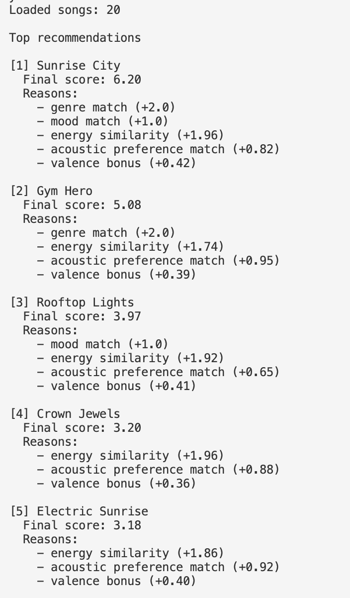
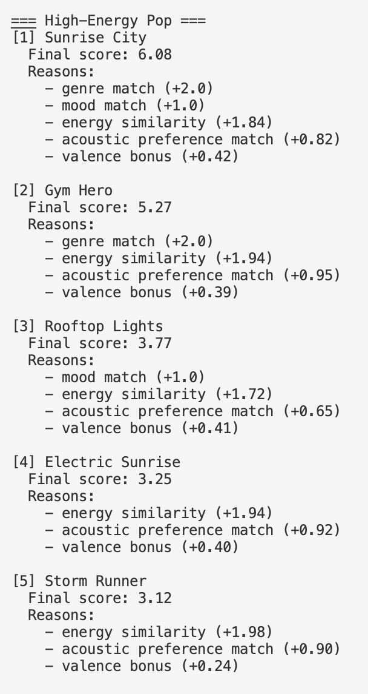
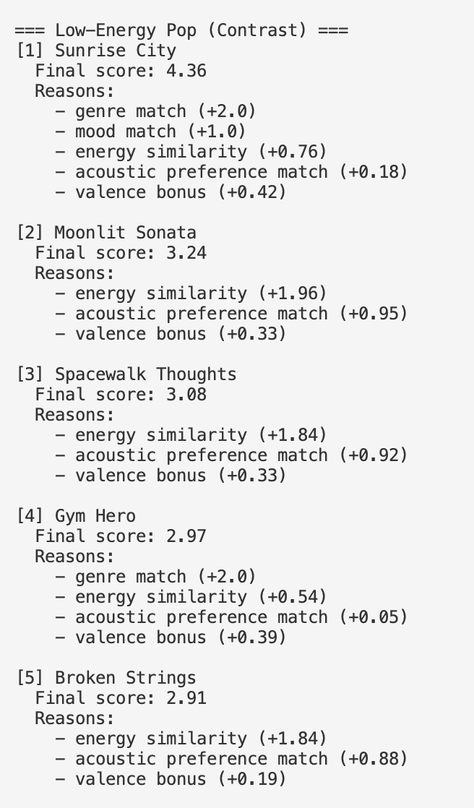
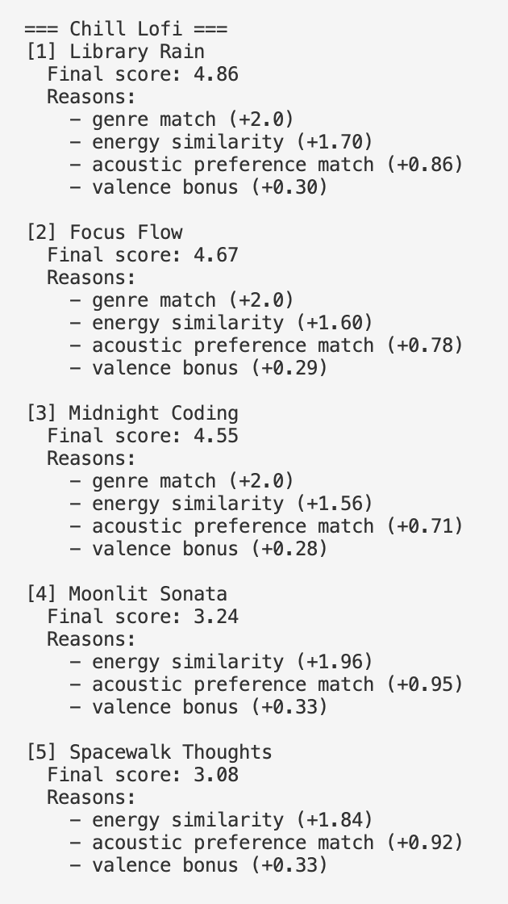
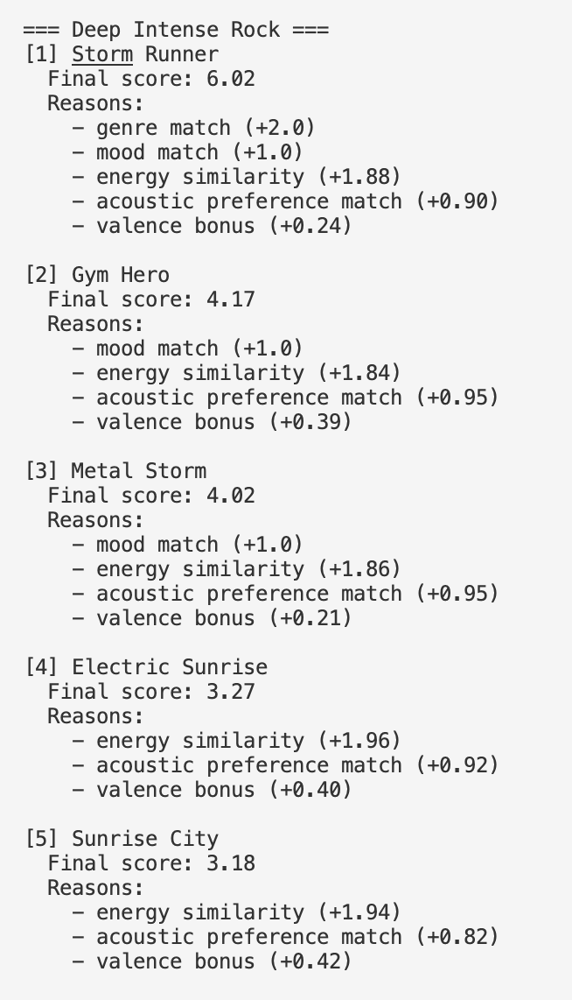
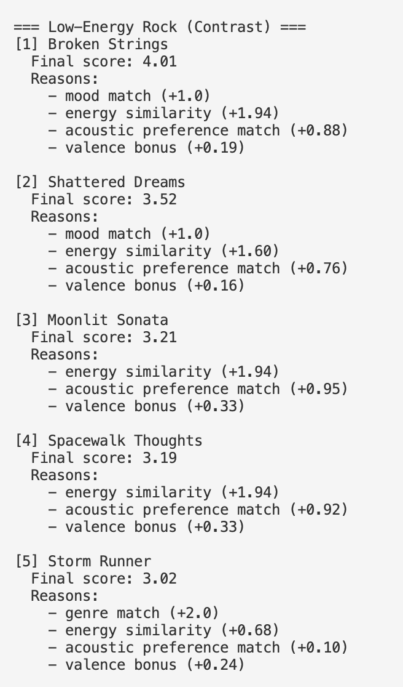
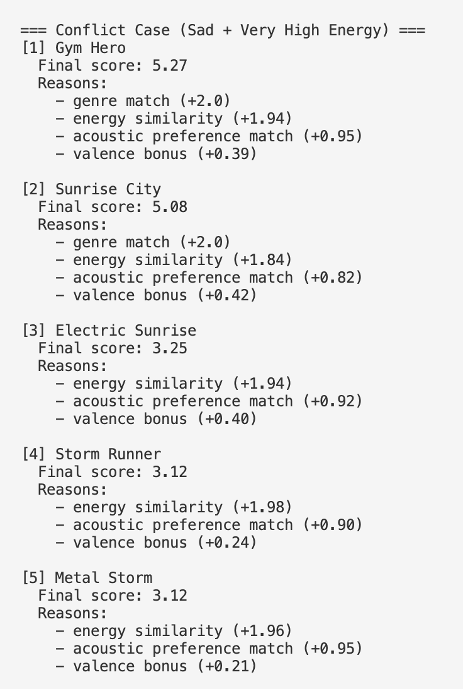
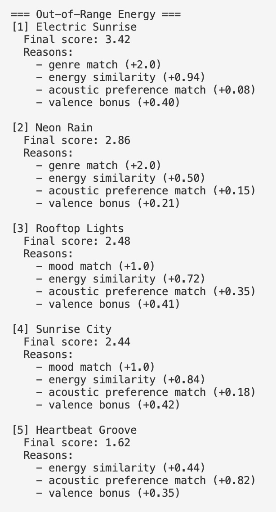
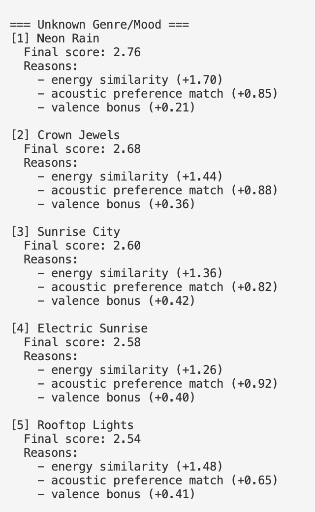

# 🎵 Music Recommender Simulation

## Project Summary

In this project, I built a simple content-based music recommender system that suggests songs based on their features and a user’s taste profile. Each song is represented using attributes like genre, mood, energy, and acousticness, and the system scores how well each song matches the user’s preferences. It then ranks all songs and returns the top results along with explanations for why they were recommended. Through this process, the project demonstrates how recommendation systems translate user preferences into numerical scores and highlights both the strengths and limitations of feature-based recommendations.

---

## How The System Works

Each song has categorical and numerical features, including genre, mood, energy, valence, tempo, and more. The UserProfile stores the user's preferred genre, mood, and energy level. The Recommender computes a score for each song based on how closely it matches the user's preferences, using a weighted sum of the differences between the song's features and the user's profile. The top-scoring songs are recommended to the user. It calculates the score for which songs to recommend by scoring every song in the dataset and then returning the top songs as recommendations.

The recommender takes a user profile and scores every song in the CSV, then ranks songs by total score.

Plan:

1. Read user preferences: favorite_genre, favorite_mood, target_energy, likes_acoustic.
2. Loop through each song in the dataset.
3. For each song, calculate points from the Algorithm Recipe below.
4. Store each song with its total score and short explanation.
5. Sort all songs from highest score to lowest.
6. Return the top K songs as recommendations.

Algorithm Recipe:

- Genre match: +2.0 points.
- Mood match: +1.0 point.
- Energy similarity: up to +2.0 points based on closeness to target energy.
  - Formula: energy_points = 2.0 \* (1 - abs(song_energy - target_energy))
  - Clamp at 0.0 minimum.
- Acousticness preference (if used):
  - If likes_acoustic is true, reward higher acousticness (for example +acousticness).
  - If likes_acoustic is false, reward lower acousticness (for example +(1 - acousticness)).
- Optional small bonuses (low weight): valence or danceability.

Potential Biases and Risks:

- This system may over-prioritize genre, which could lead to less diverse recommendations.
- Exact mood labels can be too rigid, especially when moods overlap (for example, chill vs relaxed).
- A single target energy value can unfairly penalize songs that vary in intensity but still fit the user.
- Small catalogs amplify bias because underrepresented genres or moods get fewer chances to appear in top results.

Example output:
.

## Getting Started

### Setup

1. Create a virtual environment (optional but recommended):

   ```bash
   python -m venv .venv
   source .venv/bin/activate      # Mac or Linux
   .venv\Scripts\activate         # Windows

   ```

2. Install dependencies

```bash
pip install -r requirements.txt
```

3. Run the app:

```bash
python -m src.main
```

### Running Tests

Run the starter tests with:

```bash
pytest
```

You can add more tests in `tests/test_recommender.py`.

---

## Experiments You Tried

Use this section to document the experiments you ran. For example:

- What happened when you changed the weight on genre from 2.0 to 0.5
- What happened when you added tempo or valence to the score
- How did your system behave for different types of users

I evaluated the recommender with three baseline profiles and three edge-case/adversarial profiles to test whether the scoring logic can be tricked or behaves unexpectedly.

Baseline profiles:

- High-Energy Pop
- Low-Energy Pop
- Chill Lofi
- Deep Intense Rock
- Low-Energy Rock

Adversarial or edge-case profiles:

- Conflict Case (Sad + Very High Energy)
- Out-of-Range Energy (energy set to 1.4)
- Unknown Genre/Mood (labels not present in the dataset)

The runner in `src/main.py` now executes all profiles and prints top-5 recommendations for each.

#### High-Energy Pop



#### Low-Energy Pop



#### Chill Lofi



#### Deep Intense Rock



#### Low-Energy Rock



#### Conflict Case (Sad + Very High Energy)



#### Out-of-Range Energy



#### Unknown Genre/Mood



---

## Limitations and Risks

- Works on a very small dataset, so recommendations lack variety and realism
- Relies only on basic features (genre, mood, energy, acousticness) and ignores things like lyrics, themes, or cultural context
- Uses exact matching for genre and mood, which can exclude similar songs with slightly different labels
- Can over-favor genre since it has the highest weight, leading to repetitive recommendations
- Assumes simple, fixed user preferences, even though real tastes are more complex and change over time
- Limited ability to promote diversity or discovery, so results can feel too similar to each other

---

## Reflection

[**Model Card**](model_card.md)

Through this project, I learned how recommender systems convert user preferences and item features into numerical scores that can be used to rank results. Even a simple system requires careful decisions about which features to include and how much weight to assign to each one. I also saw how small design choices, like using exact matches for genre or heavily weighting certain features, can significantly influence the final recommendations.

One important takeaway was how easily bias and unfairness can appear in recommender systems. For example, the system can favor certain genres or exclude songs that do not exactly match user-defined categories, even if they are similar in style. This made me realize that real-world systems must carefully balance personalization with diversity and fairness to avoid limiting what users are exposed to.

---

## 7. `model_card_template.md`

# 🎧 Model Card: Music Recommender Simulation

## 1. Model Name

The Music-inator 3000

---

## 2. Intended Use

This recommender system is designed to generate music recommendations based on song features, such as genre, mood, energy, and acousticness. It suggests songs that are similar in overall vibe, prioritizing how a song feels rather than relying on other users’ behavior. This project is primarily intended for classroom exploration and learning purposes, not for real-world deployment. It demonstrates how a simple content-based recommender works, including how features are weighted, how scores are computed, and how recommendations are ranked.

## 3. How the Model Works

The model recommends songs by comparing each song’s features to the user’s preferences. It gives higher scores to songs that match the user’s favorite genre and mood, and also considers whether a song fits the user’s preference for acoustic or more electronic sounds, and gives a small bonus to more positive-sounding songs. All of these factors are combined into a single score for each song, and the highest-scoring songs are recommended. Compared to the starter logic, I added a more detailed scoring system with weighted features and explanations so users can understand why each song was chosen.

---

## 4. Data

The dataset contains a small catalog of songs (around 20 total), each with features like genre, mood, energy, valence, danceability, and acousticness. It includes a mix of genres such as pop, rock, lofi, and jazz, along with moods like happy, chill, and intense. I expanded the dataset slightly by adding new songs to increase variety, but it is still relatively limited in size and diversity. Because of this, many aspects of real musical taste are missing, such as more niche genres, more nuanced moods, and broader variation in style, which can limit how well the recommender generalizes.

---

## 5. Strengths

The system works well for users with clear, consistent preferences, such as someone who knows their favorite genre and mood (e.g., “chill lofi” or “energetic pop”). The scoring prioritizes songs that closely match multiple preferences at once, so top recommendations usually feel like strong matches. In testing, the highest-ranked songs generally aligned with what I would expect given the user profile, especially when the dataset contained songs that clearly fit those preferences.

---

## 6. Limitations and Bias

One weakness is that acousticness is treated as a binary preference, which may not reflect how users actually feel about it. This could unfairly penalize songs that have a mix of acoustic and electronic elements, which are common in genres like indie pop or R&B.
Another weakness is that the model assumes all users want one specific energy level, which may not be true. Some users might enjoy a mix of high and low energy songs depending on their mood or activity, but the current scoring penalizes any song that deviates from the target energy, even if it matches other preferences well.

---

## 7. Evaluation

I tested nine distinct user profiles to evaluate the system's sensitivity and identify potential biases, including direct contrast cases:

1. **High-Energy Pop** — genre: pop, mood: happy, energy: 0.9, dislikes acoustic
2. **Low-Energy Pop** — genre: pop, mood: happy, energy: 0.2, likes acoustic
3. **Chill Lofi** — genre: lofi, mood: calm, energy: 0.2, likes acoustic
4. **Deep Intense Rock** — genre: rock, mood: intense, energy: 0.85, dislikes acoustic
5. **Low-Energy Rock** — genre: rock, mood: sad, energy: 0.25, likes acoustic
6. **Conflict Case (Sad + Very High Energy)** — genre: pop, mood: sad, energy: 0.9, dislikes acoustic
7. **Out-of-Range Energy** — genre: electronic, mood: happy, energy: 1.4 (beyond typical 0–1 range), likes acoustic
8. **Unknown Genre/Mood** — genre: "hyperfolk" (not in catalog), mood: "melancholic-ecstatic" (hybrid label), energy: 0.5, dislikes acoustic

I looked to see whether top recommendations actually matched the stated preferences, how the system handled impossible requests, and whether it gracefully handled music tastes outside the standard dataset categories.

When preferences are straightforward (pop + happy + high energy) genre and mood matches show up as expected, and energy similarity works well—high-energy profiles get high-energy songs, low-energy profiles get mellow songs. However, when preferences conflict (sad + very high energy), the system struggles to find good matches because it heavily penalizes energy mismatch, so the recommendations don't strongly match the preferences. I was surprised by this because I thought that conflict would just result in a mix of songs.

It also didn't function well with out-of-range and non-existent genres. When energy was set to 1.4 (impossible), scores for all songs tanked because they're all equally far from the target. There's no "here are the highest-energy songs available" fallback. And when using a genre that doesn't exist, the system lost both the genre and mood bonuses and just fell back on energy/acousticness/valence, resulting in generic recommendations.

---

## 8. Future Work

In the future, I would improve the model by adding more nuanced features, such as user preference for tempo or even multiple favorite genres instead of just one. I would also make the system more flexible by allowing fuzzy matching for genre and mood, so similar labels can still receive partial credit. To improve recommendation quality, I would add diversity constraints so the top results are not too similar to each other, helping users discover new types of music. I would also enhance the explanation system to be more user-friendly, possibly summarizing reasons in natural language instead of listing raw scores. Finally, I would explore incorporating simple forms of collaborative filtering to better handle more complex and evolving user tastes.

---

## 9. Personal Reflection

Through this project, I learned how recommendation systems translate user preferences into numerical scores and how small design choices, like feature weights, can significantly affect results. One interesting discovery was how easily the system can create filter bubbles, especially when using strict matching rules for things like genre or mood. This made me realize that real music platforms have to carefully balance personalization with diversity to avoid narrowing a user’s experience.
